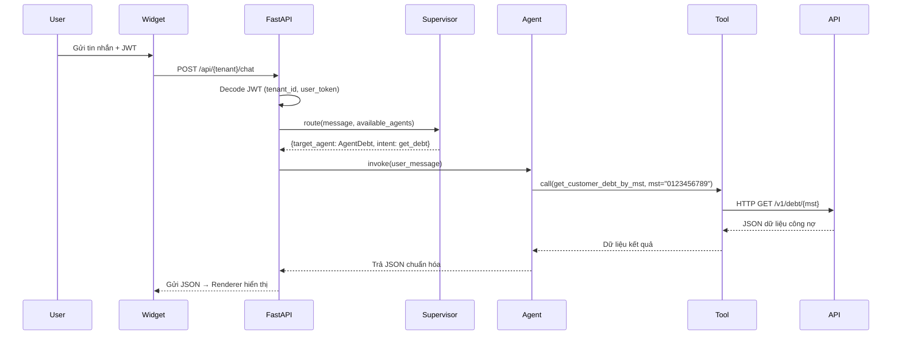
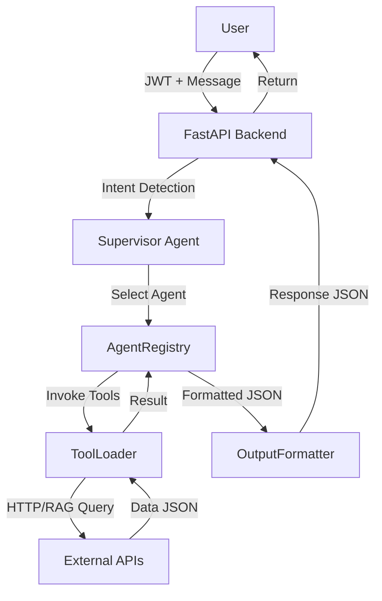

# 🧾 BẢN ĐẶC TẢ NGHIỆP VỤ – AGENTHUB CHATBOT (LangChain Architecture)

## 1. Thông tin chung
| Mục | Nội dung |
|------|-----------|
| **Tên hệ thống** | AgentHub Multi-Agent Chatbot Framework |
| **Phiên bản** | v2.0 |
| **Công nghệ** | LangChain, FastAPI, PostgreSQL, Redis, ChromaDB |
| **Mục tiêu** | Xây dựng chatbot đa nghiệp vụ, cho phép người dùng và doanh nghiệp tương tác qua ngôn ngữ tự nhiên để truy xuất, xử lý và hiển thị dữ liệu nội bộ (ERP, CRM, eFMS, eTMS...). |
| **Đặc điểm nổi bật** | Config-driven, Multi-Agent, Multi-Tenant, Dynamic Tool Loading, JWT-secured, Structured Output |

---

## 2. Cấu trúc hệ thống (High-level Overview)
```
User → Widget / API
      ↓
SupervisorAgent (Intent Routing)
      ↓
Domain Agents (Debt, Shipment, OCR, Analysis)
      ↓
ToolLoader (HTTPGetTool / RAGTool / DBQueryTool)
      ↓
Backend API / Knowledge Base
      ↓
OutputFormatter → Renderer (UI)
```

---

## 3. Thành phần kiến trúc
| Thành phần | Vai trò | Công nghệ |
|-------------|----------|------------|
| **Frontend Widget** | Giao diện chat nhúng, gửi JWT + message đến backend | HTML/JS + postMessage |
| **FastAPI Backend** | API trung gian điều phối giữa user, supervisor, và agents | FastAPI (async) |
| **SupervisorAgent** | Phân tích intent + entity, chọn agent phù hợp | LangChain + LLM nhỏ |
| **Domain Agents** | Xử lý nghiệp vụ, reasoning và gọi tools | LangChain AgentExecutor |
| **ToolLoader** | Khởi tạo công cụ động từ DB (HTTP, RAG, DB...) | LangChain Tool + Pydantic |
| **OutputFormatter** | Chuẩn hóa output (JSON, Markdown, Chart) | Python custom renderer |
| **LLM Factory** | Quản lý model (GPT, Gemini, OpenRouter) | LangChain LLMs |
| **Redis** | Cache cấu hình agent & session | Redis |
| **PostgreSQL** | Lưu cấu hình agent/tool/tenant, hội thoại | Async SQLAlchemy |
| **ChromaDB** | Lưu vector embeddings cho RAG | Chroma |

---

## 4. Mô hình dữ liệu chính
| Bảng | Vai trò | Quan hệ |
|-------|----------|----------|
| `base_tools` | Định nghĩa loại tool (HTTP, RAG, SQL, OCR...) | `tool_configs.base_tool_id` |
| `tool_configs` | Tool cụ thể (endpoint, schema, headers...) | `agent_tools.tool_id` |
| `agent_configs` | Định nghĩa từng Agent (prompt, llm_model, tool_ids, output_format) | `tenant_agent_permissions.agent_id` |
| `llm_models` | Danh sách model có sẵn (GPT, Gemini, Claude...) | `agent_configs.llm_model_id` |
| `tenant_llm_configs` | Phân quyền model theo tenant | FK `llm_model_id` |
| `tenant_tool_permissions` | Quyền tool theo tenant | FK `tool_id` |
| `tenant_agent_permissions` | Quyền agent theo tenant | FK `agent_id` |
| `output_formats` | Chuẩn hóa format kết quả và renderer hint | FK `tool_configs.output_format_id` |
| `sessions` | Phiên hội thoại | FK `tenant_id`, `agent_id` |
| `messages` | Tin nhắn trong hội thoại | FK `session_id` |

---

## 5. Luồng hoạt động chatbot


---

## 6. Flow xử lý tin nhắn (Handle Message)
| Bước | Mô tả | Thực hiện tại |
|-------|-------|----------------|
| ① | Nhận message + JWT | FastAPI `/chat` |
| ② | Giải mã JWT | `security.py` |
| ③ | Xác định available_agents | `tenant_service.py` |
| ④ | Supervisor routing → chọn agent | `supervisor.py` |
| ⑤ | Lấy agent instance từ cache | `AgentRegistry` |
| ⑥ | Agent reasoning + gọi tool | LangChain AgentExecutor |
| ⑦ | ToolLoader tạo tool instance + thêm JWT header | `tool_loader.py` |
| ⑧ | Nhận output → chuẩn hóa theo `output_formats` | `OutputFormatter` |
| ⑨ | Trả response JSON | `/chat` endpoint |

---

## 7. Factory & Runtime Architecture
| Thành phần | Vai trò |
|-------------|----------|
| **LangChainFactory** | Tạo LLM, Tool, Agent từ cấu hình DB |
| **AgentRegistry** | Cache & quản lý agent đã load |
| **SupervisorAgent** | Xác định intent và định tuyến agent |
| **OutputFormatter** | Áp dụng format từ bảng `output_formats` |
| **ToolLoader** | Tải và build tool instance từ DB |
| **FastAPI Endpoint** | Điều phối toàn bộ message pipeline |

---

## 8. Output Format & Rendering
| Thành phần | Vai trò | Ví dụ |
|-------------|----------|--------|
| **output_formats** | Chuẩn hóa cấu trúc dữ liệu output | structured_json, markdown_table, chart_data |
| **tool_configs.output_format_id** | Tool chọn format mặc định | FK → output_formats.id |
| **agent_configs.default_output_format_id** | Agent fallback format | structured_json |
| **tenant_agent_permissions.output_override_id** | Tenant override format | chart_data (tùy chọn) |
| **renderer_hint** | Hướng dẫn UI render | {"type": "table", "fields": ["col1","col2"]} |

---

## 9. JWT & Bảo mật
| Thành phần | Mô tả |
|-------------|--------|
| **JWT Decode** | Giải mã `tenant_id`, `user_id`, `access_token` |
| **Context Passing** | Truyền `user_token` vào tool context |
| **Secure Headers** | Tool tự thêm `Authorization: Bearer <user_token>` khi gọi API |
| **Tenant Isolation** | Redis + DB namespaced theo tenant |
| **Key Management** | API key được mã hóa bằng Fernet trong DB |

---

## 10. Flow runtime (tổng thể)


---

## 11. Đặc tả nghiệp vụ cụ thể
| Nghiệp vụ | Agent | Tool | Output |
|------------|--------|-------|---------|
| **Tra cứu công nợ** | AgentDebt | get_customer_debt_by_mst, get_salesman_debt | structured_json |
| **Theo dõi vận đơn** | AgentShipment | get_shipment_status | structured_json |
| **OCR File** | AgentOCR | extract_text_from_image | summary_text |
| **Phân tích dữ liệu** | AgentAnalysis | search_knowledge, query_db | chart_data |

---

## 12. Luồng dữ liệu backend (Data Layer)
| Giai đoạn | Nguồn | Mục đích |
|------------|--------|-----------|
| Base Setup | `base_tools`, `output_formats`, `llm_models` | Tạo nền tảng hệ thống |
| Agent Setup | `agent_configs`, `agent_tools` | Khai báo domain agent |
| Tenant Setup | `tenant_agent_permissions`, `tenant_llm_configs` | Bật agent & model cho tenant |
| Runtime | Redis cache, LangChainFactory | Sinh LLM, Tool, Agent instance |
| Session | PostgreSQL, Redis | Lưu hội thoại & context |

---

## 13. Chiến lược mở rộng
| Mục tiêu | Cách thực hiện |
|-----------|----------------|
| ➕ Thêm Agent mới | Thêm `agent_configs` + tool list |
| ➕ Thêm Tool mới | Đăng ký `tool_configs` + `base_tool_id` |
| ➕ Bật cho Tenant | Cập nhật `tenant_agent_permissions` |
| 🔄 Reload Agent | Cập nhật cache runtime (TTL hoặc signal) |
| 🧩 Thêm RAG | Add `RAGTool` + `knowledge_documents` |
| 📊 Tracking | Log agent, tool, latency, cost |

---

## 14. Tổng kết nghiệp vụ
| Tầng | Mô tả | Thực hiện |
|------|-------|-------------|
| **SupervisorAgent** | Xác định domain (AgentDebt, Shipment, Analysis...) | LLM nhỏ (GPT-4o-mini) |
| **Domain Agent** | Reasoning + Tool calling | LangChain AgentExecutor |
| **Tool** | Thực thi tác vụ thật (HTTP, SQL, OCR, RAG) | LangChain Tool |
| **Formatter** | Chuẩn hóa kết quả JSON | OutputFormatter |
| **Widget/UI** | Hiển thị bảng, chart, text | React/Vue |

---

## 15. Mục tiêu thành công (Success Metrics)
| Tiêu chí | Mục tiêu |
|-----------|-----------|
| **Response time** | < 2.5s |
| **Cache hit rate** | > 90% |
| **JWT validation** | < 50ms |
| **Uptime** | > 99.9% |
| **New agent setup** | < 5 phút |
| **Tool reuse rate** | > 70% |

---

## 16. Tầm nhìn
> "AgentHub giúp doanh nghiệp trò chuyện với hệ thống của chính họ. Mỗi Agent là một domain thông minh – có thể tùy chỉnh, bảo mật, và mở rộng vô hạn."

